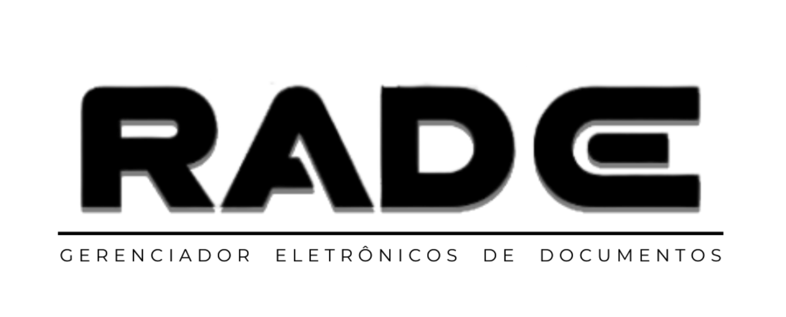

<h1 align='center'>
  
</h1>

# Gerenciador de Arquivos com OCR 📄

Este projeto é um gerenciador de arquivos desenvolvido em Python que integra a poderosa ferramenta de reconhecimento óptico de caracteres (OCR), Tesseract. Com este aplicativo, você pode facilmente gerenciar seus documentos e, através do OCR, extrair informações das imagens.

## Tecnologias Usadas ⚙️

* Python
* PostgreSQL
* Sqlalchemy
* PyTesseract
* Streamlit
* Poppler
