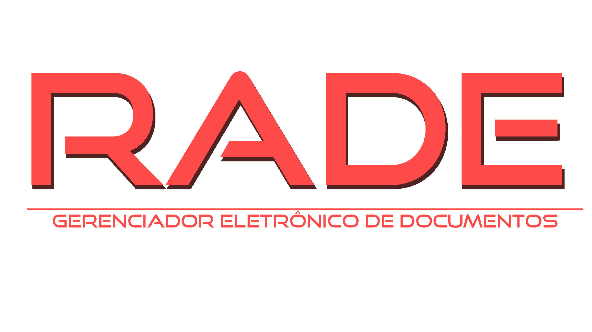

<h1 align='center'>
  
</h1>

# File Manager with OCR 📄
This project is a file manager developed in Python that integrates the powerful optical character recognition (OCR) tool, Tesseract. With this application, you can easily manage your documents and extract information from images through OCR.

## Used Technologies ⚙️
* Python
* PostgreSQL
* Sqlalchemy
* PyTesseract
* Streamlit
* Poppler

## How To use 👩‍💻
1. Install all dependencies on the file .toml
2. Install PyTesseract -> [PyTesseract](https://pypi.org/project/pytesseract/#description)
3. Install Poppler -> [Poppler](https://github.com/oschwartz10612/poppler-windows/releases/tag/v24.02.0-0)
4. Run the app.py file on the main folder

## Contributing 🫂
🪲**Report bugs:** If you encounter any bugs, please let us know. Open up an issue and let us know the problem. 
👨‍💻**Contribute code:** If you are a developer and want to contribute, follow the instructions below to get started! 
💡**Suggestions:** If you don't want to code but have some awesome ideas, open up an issue explaining some updates or imporvements you would like to see! 
📄**Documentation:** If you see the need for some additional documentation, feel free to add some! 

## Instructions 📝
1. Fork this repository
2. Clone the forked repository
3. Add your contributions (code or documentation)
4. Commit and push
5. Wait for pull request to be merged
